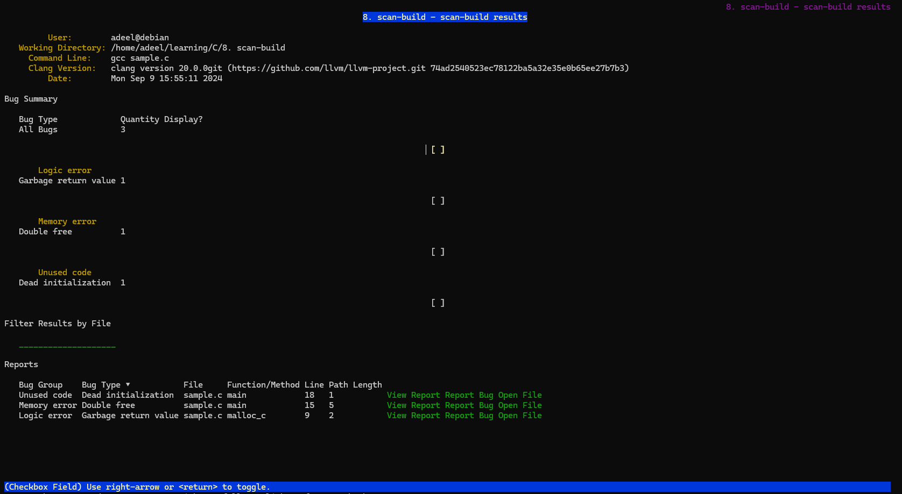
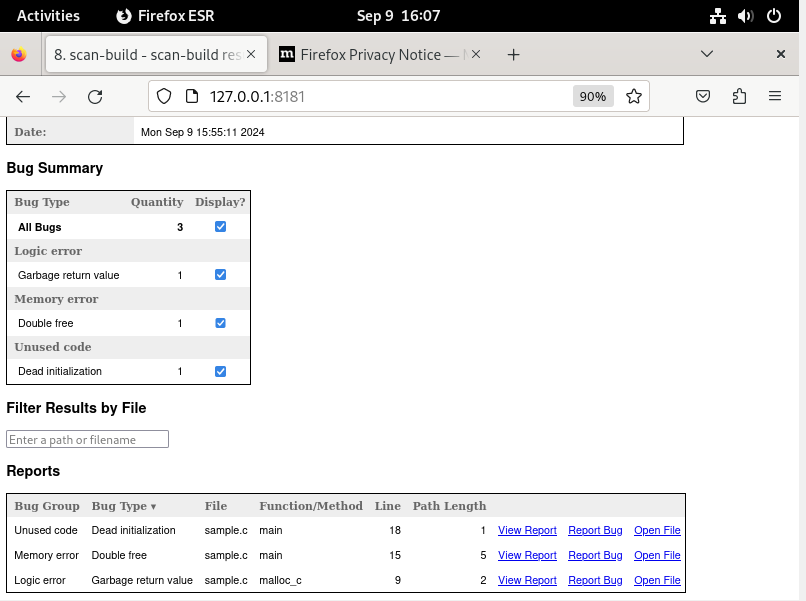

# Scan Build

## Installation.

1. Scan build has installation available for mac but for linux and windows clang has to be built from [source](https://clang.llvm.org/get_started.html). Scan-Build is enabled by default while building clang

## Running

1. To run the you can either use make or directly give compiler and file 

```console 
adeel@debian:~/learning/C/8. scan-build$ ~/llvm-project/build/bin/scan-build gcc sample.c 
scan-build: Using '/home/adeel/llvm-project/build/bin/clang-20' for static analysis
sample.c:9:5: warning: Undefined or garbage value returned to caller [core.uninitialized.UndefReturn]
    9 |     return *c;
      |     ^~~~~~~~~
sample.c:15:5: warning: Attempt to free released memory [unix.Malloc]
   15 |     free(x); // Double free
      |     ^~~~~~~
sample.c:18:9: warning: Value stored to 'z' during its initialization is never read [deadcode.DeadStores]
   18 |     int z = a + 10;  // Undefined Behaviour
      |         ^   ~~~~~~
3 warnings generated.
scan-build: Analysis run complete.
scan-build: 3 bugs found.
scan-build: Run 'scan-view /tmp/scan-build-2024-09-09-155511-1803566-1' to examine bug reports.

```

2. Then you can use scan view to view it 

`~/llvm-project/build/bin/scan-view  /tmp/scan-build-2024-09-09-155511-1803566-1`




### TODO
1. Add memory leaks examples go through reports
